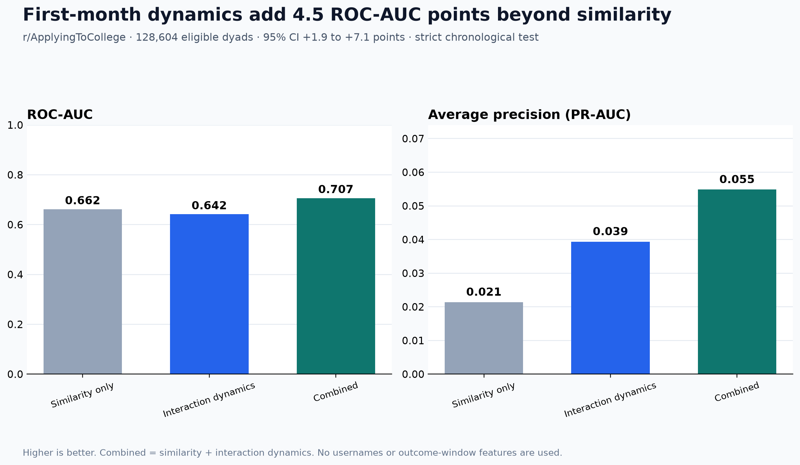

# Connection Dynamics

Can the way two people interact during their first month predict whether they will still interact
months later—beyond what their profiles have in common?

## Result

**Adding first-month interaction dynamics improved durable-tie prediction by 4.5 ROC-AUC points
over profile similarity alone**: 0.662 → 0.707 on a strict chronological test set. The paired
bootstrap 95% interval was **+1.9 to +7.1 points**. Average precision rose from 0.021 to 0.055
(+0.033; 95% interval +0.015 to +0.065) against a 1.06% test-set prevalence.



This supports the precise claim that dynamics add useful information beyond similarity. It does not
show that dynamics alone dominate every similarity signal: the dynamics-only model scored 0.642
ROC-AUC, below the 0.662 similarity model, while the combined model performed best.

| Feature set | ROC-AUC | PR-AUC | MRR | Recall@10 |
|---|---:|---:|---:|---:|
| Profile similarity | 0.662 | 0.021 | 0.311 | 0.523 |
| Interaction dynamics | 0.642 | 0.039 | 0.367 | 0.547 |
| Combined | **0.707** | **0.055** | **0.392** | **0.576** |

The headline cohort contains 128,604 eligible `r/ApplyingToCollege` dyads, including 2,369 durable
ties. The final test period contains 19,291 dyads and 205 positives. Aggregate results, split counts,
ranking metrics, bootstrap intervals, and held-out SHAP values are in
[`artifacts/results.json`](artifacts/results.json).

## Research design

- **Unit:** an unordered pair of distinct, non-deleted Reddit authors after their first direct reply.
- **Profile window:** days -30 to 0 before first contact.
- **Dynamics window:** days 0 to 30 after first contact.
- **Positive outcome:** at least one direct reply in each direction during days 90 to 180.
- **Negative outcome:** no direct reply in days 90 to 180 while both authors remain active.
- **Censored:** incomplete follow-up, either author inactive, or one-directional outcome interaction.
- **Split:** earliest 70% train, next 15% validation, final 15% test by first-contact time.
- **Primary metric:** average precision; ROC-AUC and partner-ranking metrics are also reported.

The outcome is durable *online interaction*, not friendship, intimacy, mental health, or a causal
effect of communication behavior.

## Features

| Family | Examples | Availability |
|---|---|---|
| Profile similarity | pre-contact topic overlap, activity match, shared communities | Before contact |
| Interaction dynamics | reply count, reciprocity, latency symmetry, effort balance, regularity, recency | First 30 days |
| Behavioral annotation | disclosure depth, disclosure reciprocity, supportive responses | First 30 days |
| Graph | prior-year node2vec proximity and coverage | Before each target year |

Held-out mean absolute SHAP values place lexical topic overlap, pre-contact activity balance, and
interaction recency at the top of the combined model. The annotation extension is intentionally not
in the headline: 216,456 outcome-blinded messages are prepared, but no provider credential was
available for a real scoring run. No claim about disclosure being the strongest signal is made yet.

The corrected node2vec analysis uses annual snapshots containing only earlier-year edges. Coverage is
49.7% for 2018 dyads; graph features do not improve the combined model. That negative ablation is kept
because it is more informative than forcing a graph model into the headline. A temporal GNN remains
future work only after a larger graph has adequate historical coverage.

## Data

The reader consumes official ConvoKit by-subreddit archives. Raw archives are downloaded locally and
never committed. The headline uses `r/ApplyingToCollege`; `r/Cornell` is a smaller parser and cohort
feasibility check. `r/ChangeMyView` is supported by the interface but excluded from the current result
because its 1.27 GB compressed archive requires a scale-out runtime not available on this workstation.

- [ConvoKit subreddit corpus documentation](https://convokit.cornell.edu/documentation/subreddit.html)
- [ConvoKit archive index](https://zissou.infosci.cornell.edu/convokit/datasets/subreddit-corpus/corpus-zipped/)

## Reproduce

```powershell
python -m venv .venv
.venv\Scripts\python -m pip install -e ".[model,dev]"
$env:CONNECTION_DYNAMICS_HASH_KEY = '<private-random-key>'

connection-dynamics build-panel `
  data/raw/ApplyingToCollege.corpus.zip `
  --output data/processed/applying_to_college_panel.csv `
  --summary artifacts/private/panel_summary.json

connection-dynamics benchmark `
  data/processed/applying_to_college_panel.csv `
  --output artifacts/results.json `
  --predictions artifacts/private/predictions.csv `
  --hero-chart artifacts/hero.png `
  --study-label 'r/ApplyingToCollege · 128,604 eligible dyads' `
  --bootstrap 2000

pytest
ruff check src tests
```

The optional annotation workflow is outcome-blinded, resumable, and compatible with OpenAI or an
OpenAI-compatible base URL. It refuses to add disclosure features to a confirmatory benchmark unless
every dyad has complete annotation coverage. See the
[`ANNOTATION_PROTOCOL.md`](docs/ANNOTATION_PROTOCOL.md) before running it.

## Reproducibility and ethics

- [Leakage audit](docs/LEAKAGE_AUDIT.md)
- [Data and privacy](docs/DATA_CARD.md)
- [Annotation protocol](docs/ANNOTATION_PROTOCOL.md)
- [Contributing](CONTRIBUTING.md)

The public repository contains code, synthetic fixtures, aggregate metrics, and charts only. It does
not publish usernames, raw comments, annotation manifests, or row-level predictions.
